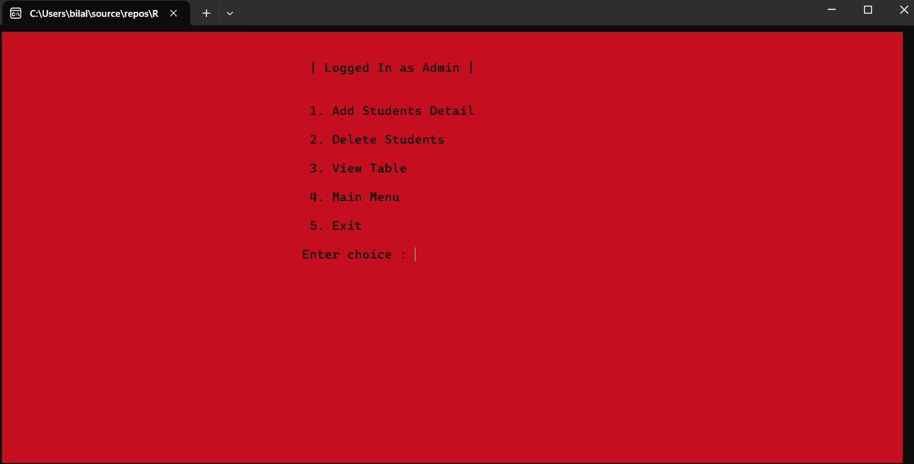

# Student Records Management System

 

## Project Description

This is a **Student Records Management System** built in C++. It offers a basic console-based interface for managing student records with functionalities like login verification, data management, and admin access. The system is designed for educational purposes, providing a simple yet functional application of C++ concepts.

## Features

- **Loading Animation:** A dynamic loading bar that runs on startup.
- **Login Verification:** Basic password protection before accessing the main system.
- **Main Menu:** Provides access to different functionalities depending on the user type (student/admin).
- **Admin Functions:** Add, view, and delete student records.
- **Student Functions:** Restricted access to viewing data.

## Getting Started

### Prerequisites

Ensure you have the following installed on your system:

- C++ Compiler (like GCC, Clang, or MSVC)
- A C++ IDE or text editor (like Visual Studio Code, CLion, etc.)
- Windows OS (for `Windows.h` dependency)

### Screenshots





### File Structure

```plaintext
student-records-management-system/
├── include/
│   ├── loading.h
│   ├── loginVerification.h
│   └── functionality.h
├── src/
│   ├── loading.cpp
│   ├── loginVerification.cpp
│   └── functionality.cpp
├── main.cpp
└── README.md

